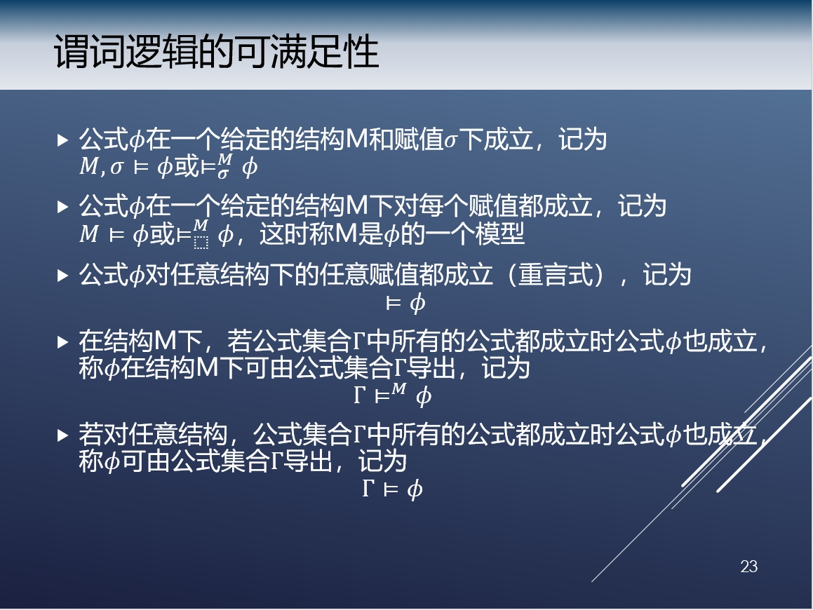
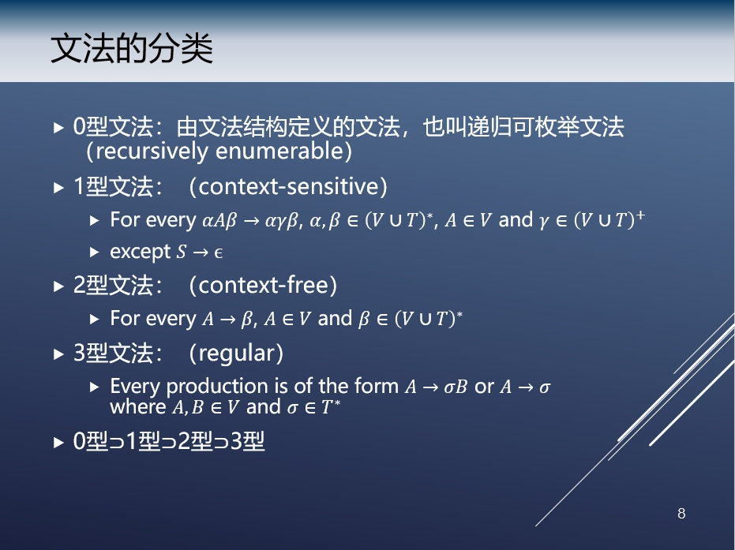
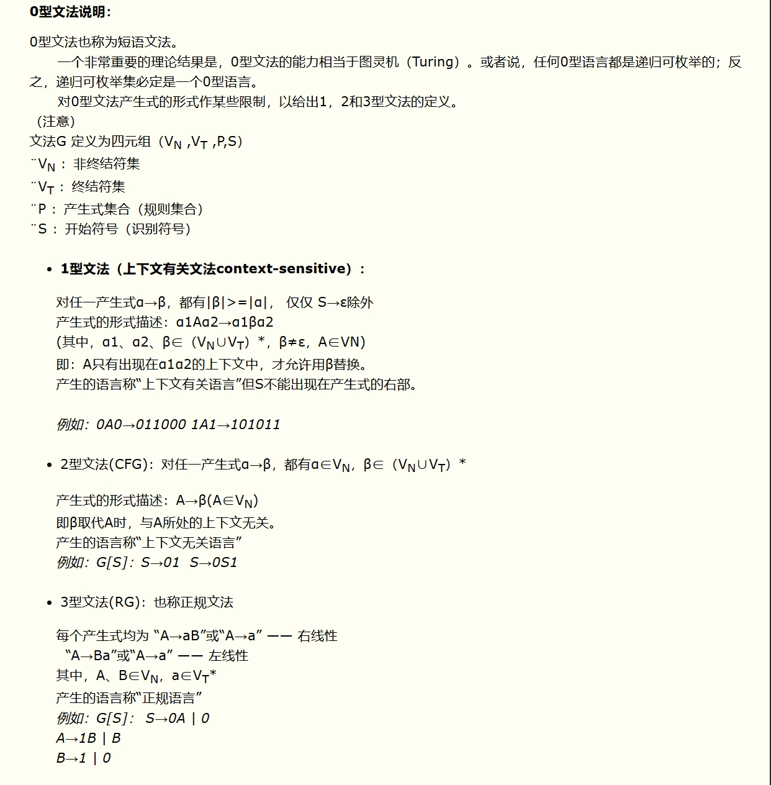

# 形式化语言与自动机理论

[TOC]

## 一、基本知识

### 集合

- 属于：x∈A
- 子集：A⊆B
- 交集：A∩B={x∈A and x∈B}
- 并集：A∪B={x∈A or x∈B}
- 差集：A\B={x∈A and x∉B}
- 补集：A ̅=U\A
- 幂集：2^S={X|X⊆S}

### 序列和元组

- 序列：有序排列的一组元素
- 元祖：有限序列
- 表示：(a,b,c)
- 笛卡尔积：A×B={(x,y)|x∈A and y∈B}
- 例：
  - A={a,b},B={1,2}
  - A×B={(a,1),(a,2),(b,1),(b,2)}

### 偏序

满足以下性质：

- 自反：对任意x，(x,x)∈R
- 反对称：对任意x，y，如果(x,y)∈R，且(y,x)∈R，则x=y
- 传递：对任意x，y，z，如果(x,y)∈R且(y,z)∈R，则(x,z)∈R

### 等价

满足以下性质：

- 自反：对任意x，(x,x)∈R
- 对称：对任意x，y，如果(x,y)∈R，则(y,x)∈R
- 传递：对任意x，y，z，如果(x,y)∈R且(y,z)∈R，则(x,z)∈R

### 函数

- 全函数：{x│(x,y)∈f}=X
- 偏函数：{x│(x,y)∈f}⊆X
- 满射函数：{y│(x,y)∈f}=Y
- 单射函数：∀x,y∈X, x≠y⇒f(x)≠f(y)
- 双射函数：满射and 单射

### 字母表、字符串和语言

- 字母表是语言中出现的原子符号，通常用Σ表示
- 字符串是字母表中元素的序列
- 字符串运算
  - 联结运算  abc.def
  - 重复运算  (abc)*
- 语言：一系列特殊字符串的集合
  - L⊆Σ^∗

### 谓词逻辑的可满足性

## 二、形式语言

### 文法

#### 关键概念

> 形式语言的语法规则是由一套规则组成，这些规则定义了该语言中有效的句子和短语的结构，G=(V,T,P,S)

- 非终结符（V）：非终结符是由终结符和其他非终结符组成的符号。非终结符可以表示一个或多个终结符的组合。例如，在HTML语言中，非终结符可以是标签、属性等。
- 终结符（T）：终结符是语言中的基本元素，它们不能再被分解为更小的部分。在形式语言中，终结符可以是字母、数字、符号等。例如，在HTML语言中，终结符可以是标签名、属性名等。
- 产生式（P）：产生式定义了如何将一个非终结符替换为一组终结符和非终结符的序列。产生式由左部和右部组成，左部是一个非终结符，右部是一个由终结符和非终结符组成的序列。例如，在HTML语言中，产生式可以定义如何将一个标签替换为标签名、属性等。

- 开始符（S）：非终结符中的一个
  ​

#### 文法示例

- G_1=({A},{0,1},{A→01,A→0A1,A→1A0},A)
- G_2=({A},{0,1},{A→0,A→0A},A)
- G_3=({A,B},{0,1},{A→01|0A1|1A0 , B→AB|0},A) 
- G_4=({A,B},{0,1,=,+,∗},
  {A→B=B,B→0 | 1 |  B+B │ B∗B}, A)
- 简写形式：
  - 只写产生式
  - 用大写字母表示非终止符号，小写字母表示终止符号
  - 若两条产生式左端相同，可以使用| 符号将其右端组合起来
  - 第一条产生式的左边是起始符号

#### 文法分类

- 0型文法（递归可枚举文法）：对产生式左右两侧不加任何限制

- 1型文法（上下文有关文法）：对于P中的每一个产生式，产生式左侧字符串长度<=右侧，产生式的形式描述：α1Aα2→α1βα2 

  　　(其中，α1、α2、β∈（V∪T）*，β≠ε，A∈V)

  　　即：A只有出现在α1α2的上下文中，才允许用β替换。

  　　产生的语言称“上下文有关语言”但S不能出现在产生式的右部。

- 2型文法（上下文无关文法）：产生式左侧字符串长度<=右侧，产生式左侧是非终结符，右侧可以是终结符和非终结符混合，或只包含一个

- 3型文法（正则文法）：在2型的基础上，右侧只能是终结符+非终结符，或者只包含终结符

#### 最左推导和最右推导

- 依据替换次序，一个语句的产生可以有多种推导
  - 最左推导：在推导过程中总是替换句子最左端的非终极符号
  - 最右推导：在推导过程中总是替换句子最右端的非终极符号
  - 任意推导：既不是最左推导也不是最右推导
- 一个语句的不同推导对应于相同的推导树
- 一个语句的推导树和其最左推导之间满足双射关系

#### 文法的等价性

- 不同文法可能产生相同的句子
- 不同的文法可能产生相同的语言
- 两个文法是等价的，当且仅当他们生成的语言是相同的
- 即使两个文法所属类型不同，他们也可能是等价的

## 三、自动机

### 确定的有限状态自动机(DFA)

> 一个确定型有穷自动机包括： DFA=(Q,Σ,δ,q0,F)

- Q：有穷的状态集合
- Σ：有穷的输入符号集合
- δ：一个转移函数，Q×Σ→Q
- q0：一个初始状态，是Q中状态之一
- F：一个终结状态或接收状态的集合F，F是Q的子集合

### 不确定的有限状态自动机(NFA)

> 一个不确定的有限状态自动机包括：NFA=(Q,Σ,δ,q0,F)

与DFA不一样之处：δ：一个转移函数，Q×Σ→2^Q

都是0/1，但是可以指向多个q，DFA一个状态只指向一个q

算出来是个集合，终结状态只要和F有交集即可

`DFA`包含在`NFA`中

`定理`：如果一个语言可以被NFA接受，就一定能被DFA接受，（反过来不用证明）

